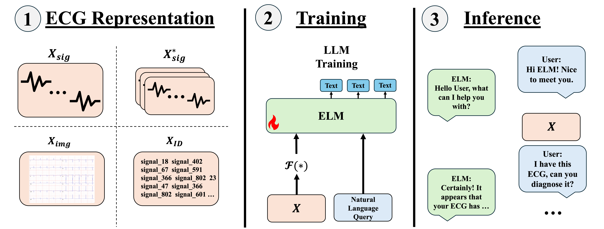

<h2 align="center">
  A Training and Evaluation Framework for ECG-Language Models (ELMs)
</h2>

<div align="center">
  
</div>

## News
- **[February 23, 2026]** We have officially moved from [willxxy/ECG-Bench](https://github.com/willxxy/ECG-Bench/) to [ELM-Researc/ELM](https://github.com/ELM-Research/ELM). There are major updates to the documentation and flow of the code. Please read the documentation and feel free to post any issues!

<!-- <details>
  <summary><strong>Show Older News</strong></summary>

- **[October 16, 2025]** We have finished the refactor, for new and old users, please refer to the documentation below and the [brief release notes](https://github.com/willxxy/ECG-Bench/releases/tag/0.0.5).
- **[October 3, 2025]** We are currently going under a big refactor for easier use of the repository. We thank you for your patience and will update once its done!
- **[October 3, 2025]** We have released our paper [Retrieval-Augmented Generation for Electrocardiogram-Language Models](https://arxiv.org/abs/2510.00261). There is currently a [pull request](https://github.com/willxxy/ECG-Bench/pull/3) for the updated integration of RAG utilized with ELMs in the paper. Feel free to check it out.
- **[August 5, 2025]** We released official splits of ELM datasets on Hugging Face. Feel free to check them out [here](#hugging-face-dataset-5-fold-stratified-splits)!
- **[May 24, 2025]** We release our paper ["Signal, Image, or Symbolic: Exploring the Best Input Representation for Electrocardiogram-Language Models Through a Unified Framework"](https://arxiv.org/abs/2505.18847) with some interesting results when comparing input representations and training paradigms for ELMs! Check it out.
- **[April 5, 2025]** We open source ECG-Bench for training and evaluating ELMs!
</details> -->


## Overview <a name="overview"></a>
A research framework for finetuning and evaluating ECG-language models (ELMs). Supports multiple architectures, training objectives, and data representations with distributed training out of the box.
Prepare datasets with [ecg_preprocess](https://github.com/ELM-Research/ecg_preprocess) before use. Additionally, if you want to pretrain an ECG encoder, please view [ecg_nn](https://github.com/ELM-Research/ecg_nn).

We hope to continuously update the repository to support more features, ELMs, and datasets. Please feel free to contribute to the repository!
If there are any questions or bugs, please do not hesitate to reach out to wjhan{@}andrew{dot}cmu{edu} or submit an issue with corresponding details.

> **Status:** Beta.

## Setup <a name="setup"></a>
We use torch 2.9 with cuda 12.8 and primarily use H100 GPUs.


```bash
git clone https://github.com/ELM-Research/ELM.git
cd ELM && uv sync
```

For BPE symbolic representation with [ECG-Byte](https://arxiv.org/abs/2412.14373), compile the Rust tokenizer:

```bash
cd src/dataloaders/data_representation/bpe
maturin develop --release
```

If Rust is not installed: `curl --proto '=https' --tlsv1.2 -sSf https://sh.rustup.rs | sh -s -- --default-toolchain=1.82.0 -y`

## ECG Datasets <a name="data"></a>

First, preprocess the ECGs using the [ecg_preprocess](https://github.com/ELM-Research/ecg_preprocess) repository.
The structure in which the `data` folder should be in is the following:

```
data
├── csn
│   ├── preprocessed_1250_250
│   ├── preprocessed_500_250
│   └── preprocessed_2500_250
├── cpsc
│   └── ...
├── ptb_xl
│   └── ...
├── mimic_iv
│   └── ...
└── code15
    └── ...
```

We support the following datasets in a unified way through datasets from HuggingFace. These datasets will include the `ecg_path` which is the path to the `.npy` files in the `data` folder. It will also include the conversational data (`text`).

| `--data`  | Link        |
|----------|------------|
| [ecg-qa-ptbxl-250-2500](https://arxiv.org/abs/2306.15681)  | [willxxy/ecg-qa-ptbxl-250-2500](https://huggingface.co/datasets/willxxy/ecg-qa-ptbxl-250-2500)   |
| [ecg-qa-mimic-iv-ecg-250-2500](https://arxiv.org/abs/2306.15681) | [willxxy/ecg-qa-mimic-iv-ecg-250-2500](https://huggingface.co/datasets/willxxy/ecg-qa-mimic-iv-ecg-250-2500) |
| [pretrain-mimic-250-2500](https://arxiv.org/abs/2408.08849)  | [willxxy/pretrain-mimic-250-2500](https://huggingface.co/datasets/willxxy/pretrain-mimic-250-2500)   |
| [ecg-grounding-250-2500](https://www.arxiv.org/abs/2503.06073)    | [willxxy/ecg-grounding-250-2500](https://huggingface.co/datasets/willxxy/ecg-grounding-250-2500)     |
| [ecg-instruct-pulse-250-2500](https://arxiv.org/abs/2410.19008)     | [willxxy/ecg-instruct-pulse-250-2500](https://huggingface.co/datasets/willxxy/ecg-instruct-pulse-250-2500)      |
| [ecg-bench-pulse-250-2500](https://arxiv.org/abs/2410.19008)     | [willxxy/ecg-bench-pulse-250-2500](https://huggingface.co/datasets/willxxy/ecg-bench-pulse-250-2500)      |
| [ecg-instruct-45k-250-2500](https://arxiv.org/abs/2408.08849)     | [willxxy/ecg-instruct-45k-250-2500](https://huggingface.co/datasets/willxxy/ecg-instruct-45k-250-2500)      |

Note that we support mixing different datasets via specifying multiple datas like so:

```
--data ecg-qa-ptbxl-250-2500 ecg-qa-mimic-iv-ecg-250-2500
```

## ECG Representations <a name="representation"></a>

| `--data_representation` | Description |
|-------------------------|-------------|
| `signal` | Raw ECG matrix $X \in \mathbb{R}^{C \times L}$ (leads × samples) |
| `symbolic` | BPE-tokenized symbolic sequence $X \in V^m$ via ECG-Byte compression |
| `stacked_signal` | Synthetic three-channel version of `signal`, denoted $X \in \mathbb{R}^{C \times L \times 3}$, by stacking `signal` three times along the color dimension |
| `rgb` | Derived from `signal` via plotting and is represented as a tensor $X \in \mathbb{R}^{H \times W \times C′}$, where `H` and `W` denote the image height and width, respectively, and `C′` is the number of color channels |

## LLMs <a name="llms"></a>
We utilize the following pretrained LLMs from HuggingFace.

| LLM | `--llm` |
|-------|--------------------|
| [Llama 3](https://arxiv.org/abs/2407.21783) | `llama-3.2-3b-instruct` |
| [Llama 3](https://arxiv.org/abs/2407.21783) | `llama-3.2-1b-instruct` |
| [Gemma 2](https://arxiv.org/abs/2408.00118) | `gemma-2-2b-it` |
| [Qwen 2.5](https://arxiv.org/abs/2412.15115) | `qwen2.5-7b-instruct` |
| [Qwen 2.5](https://arxiv.org/abs/2412.15115) | `qwen2.5-1.5b-instruct` |

## Encoders <a name="encoders"></a>

### ECG Encoders
We utilize the following ECG-specific encoders.

| ECG Encoders | `--encoder` | `--data_representation`|
|-------|--------------------|-------|
| [MERL]((https://arxiv.org/abs/2403.06659)) | `merl` | `signal` |
| [MLAE](https://ieeexplore.ieee.org/document/9980411) | `mlae` | `signal` |
| [MTAE](https://ieeexplore.ieee.org/document/9980411) | `mtae` | `signal` |
| [ST-Mem](https://arxiv.org/abs/2402.09450) | `st_mem` | `signal` |

### Vision Encoders
We utilize the following pretrained vision encoders from HuggingFace.

| Vision Encoders | `--encoder` | `--data_representation`|
|-------|--------------------|-------|
| [Siglip2](https://arxiv.org/abs/2303.15343) | `siglip2-so400m-patch16-naflex` | `rgb`, `stacked_signal` |
| [ViT](https://arxiv.org/abs/2010.11929) | `vit-base-patch16-224-in21k` | `rgb`, `stacked_signal` |
| [CLIP](https://arxiv.org/abs/2103.00020) | `clip-vit-base-patch32` | `rgb`, `stacked_signal` |

## ELMs
We implement several ELMs and describe how to train each variant.

### Llava
We implement a [Llava-like architecture]((https://arxiv.org/abs/2304.08485)) where we connect the encoder to the LLM with a projection layer.

```bash
uv run src/main_trainer.py \
  --data pretrain-mimic-250-2500 \
  --data_representation $DATA_REPRESENTATION \
  --llm qwen2.5-1.5b-instruct \
  --encoder $ECG_ENCODER or $VISION_ENCODER \
  --elm llava
```

For multi-gpu training, launch the same script like so. This is general to all ELMs.

```bash
CUDA_VISIBLE_DEVICES=0,1,2,3 \
uv run torchrun --standalone --nproc_per_node=4 \
  src/main_trainer.py \
  --data pretrain-mimic-250-2500 \
  --data_representation $DATA_REPRESENTATION \
  --llm qwen2.5-1.5b-instruct \
  --encoder $ECG_ENCODER or $VISION_ENCODER \
  --elm llava \
  --distributed
```

For ECG Encoders, you will have to pretrain your own ECG Encoder using [ecg_nn](https://github.com/ELM-Research/ecg_nn). We plan to release pretrained encoders soon! To load in the pretrained encoder during ELM training run the following:

```bash
uv run src/main_trainer.py \
  --data pretrain-mimic-250-2500 \
  --data_representation signal \
  --llm qwen2.5-1.5b-instruct \
  --encoder $ECG_ENCODER \
  --elm llava \
  --encoder_ckpt $ENCODER_CHECKPOINT.pt
```

For any setting, to update the encoder during ELM training, specify like so:

```bash
uv run src/main_trainer.py \
  --data pretrain-mimic-250-2500 \
  --data_representation $DATA_REPRESENTATION \
  --llm qwen2.5-1.5b-instruct \
  --encoder $ECG_ENCODER or $VISION_ENCODER \
  --elm llava \
  --update_encoder
```

### Encoder-free

We implement an [encoder-free ELM](https://arxiv.org/abs/2601.18798v1), similar to [Fuyu-8b](https://www.adept.ai/blog/fuyu-8b).

```bash
uv run src/main_trainer.py \
  --data pretrain-mimic-250-2500 \
  --data_representation signal \
  --llm qwen2.5-1.5b-instruct \
  --elm fuyu
```

### ECG-Byte

We implement [ECG-Byte](https://arxiv.org/abs/2412.14373) and provide a trained BPE tokenizer (`src/dataloaders/data_representation/bpe/ecg_byte_tokenizer_10000.pkl`). Note that you can also train your own BPE tokenizer in [ecg_preprocess](https://github.com/ELM-Research/ecg_preprocess), however we find ECG-Byte to be generalizable across different datasets. To train an ELM with ECG-Byte run the following:

```bash
uv run src/main_trainer.py \
  --data pretrain-mimic-250-2500 \
  --data_representation symbolic \
  --llm qwen2.5-1.5b-instruct \
  --ecg_tokenizer src/dataloaders/data_representation/bpe/ecg_byte_tokenizer_10000.pkl \
  --elm ecg_byte
```

## Evaluate
To evaluate your model, just execute the `main_evaluator.py` file while specifying your trained ELM checkpoint via `--elm_ckpt`:

```bash
uv run src/main_evaluator.py \
  --data ecg-qa-mimic-iv-ecg-250-2500 \
  --data_representation signal \
  --llm qwen2.5-1.5b-instruct \
  --encoder merl \
  --elm llava \
  --encoder_ckpt $ENCODER_CHECKPOINT.pt \
  --elm_ckpt $PATH_TO_ELM_CKPT.pt
```

## Key Flags

| Flag | Description |
|------|-------------|
| `--torch_compile` | `torch.compile` the model |
| `--data_subset` | Use dataset fraction for quick runs |
| `--augment_ecg` / `--augment_rgb` | Enable augmentations |
| `--perturb` | `noise`, `zeros`, or `only_text` |
| `--optimizer` | `adam`, `adamw`, `muon` |

## Research
We list the research that has been conducted using this repository. Please feel free to add your own research here!

- [ECG-Byte: A Tokenizer for End-to-End Generative Electrocardiogram Language Modeling
](https://arxiv.org/abs/2412.14373)
- [Signal, Image, or Symbolic: Exploring the Best Input Representation for Electrocardiogram-Language Models Through a Unified Framework](https://arxiv.org/abs/2505.18847)
- [Retrieval-Augmented Generation for Electrocardiogram-Language Models](https://arxiv.org/abs/2510.00261)
- [Encoder-Free ECG-Language Models](https://arxiv.org/abs/2601.18798)

## Contributions <a name="contributions"></a>

We welcome contributions to the repository! Please feel free to open an issue or pull request for any bugs or features you would like to add. We are always looking for new ECG datasets to benchmark our methods on. If you have any recommendations, please let us know! Also, a good place to start is by looking at the [TODO](#todo) section.

For most processes, we have a `--dev` flag to run in a smaller scale and add some verbosity for debugging. Feel free to add this flag when needed! 

### Contributors

We thank the following people for their contributions to the repository:

- [Atharva Mhaskar](https://www.linkedin.com/in/atharva-mhaskar/)
- [Xiaoyu (Simon) Song](https://www.linkedin.com/in/xiaoyu-song-507b89301/)
- [Tony Chen](https://www.linkedin.com/in/tonychen06/)

## Acknowledgements <a name="ack"></a>
This work is done in collaboration with the Mario Lemieux Center for Heart Rhythm Care at Allegheny General Hospital.

We thank Chaojing Duan, Michael A. Rosenberg, Emerson Liu, Ding Zhao, Hyoeun Kang, Wenhao Ding, Haohong Lin, Shiqi Liu, Xiaoyu (Simon) Song, Tony Chen, Atharva Mhaskar, Zhepeng Cen, Yihang Yao, and Dylan Leong for their helpful discussions, feedbacks, and support in developing ECG-Bench.

We thank the authors of [ECG-Byte](https://github.com/willxxy/ECG-Byte), [MERL](https://github.com/cheliu-computation/MERL-ICML2024), [ST-MEM](https://github.com/bakqui/ST-MEM), [ECG-QA](https://github.com/Jwoo5/ecg-qa), [ECG-Chat](https://github.com/YubaoZhao/ECG-Chat), [PULSE](https://github.com/AIMedLab/PULSE), and [GEM](https://github.com/lanxiang1017/GEM) for their code and publicly released datasets.

Lastly, we thank [HuggingFace](https://huggingface.co/) for providing the APIs for the models.

## License

MIT, except `st_mem.py`, `mlae.py`, `mtae.py` which are [CC BY-NC 4.0](https://github.com/bakqui/ST-MEM?tab=License-1-ov-file#readme).