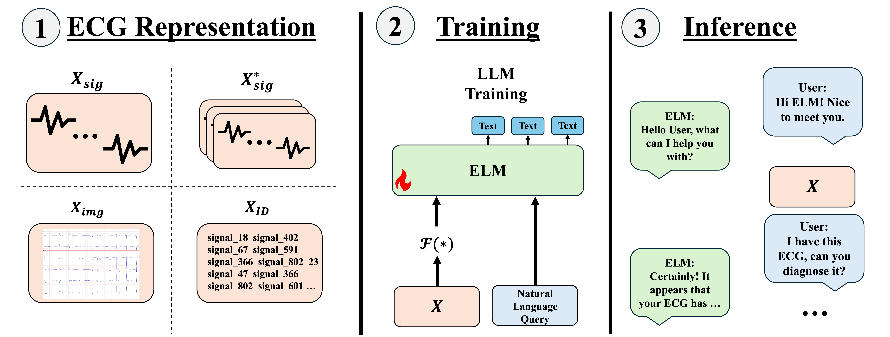

<h2 align="center">
  A Training and Evaluation Framework for ECG-Language Models (ELMs)
</h2>

<div align="center">
  
</div>

## Overview <a name="overview"></a>
A research framework for finetuning and evaluating ECG-language models (ELMs). Supports multiple architectures, training objectives, and data representations with distributed training out of the box.
Prepare datasets with [ECG-Preprocess](https://github.com/ELM-Research/ECG-Preprocess) before use. Additionally, if you want to pretrain an ECG encoder, please view [ECG-Neural-Networks](https://github.com/ELM-Research/ECG-Neural-Networks).

We hope to continuously update the repository to support more features, ELMs, and datasets. Please feel free to contribute to the repository!
If there are any questions or bugs, please do not hesitate to reach out to wjhan{@}andrew{dot}cmu{edu} or submit an issue with corresponding details.

> **Status:** Beta.

## Setup <a name="setup"></a>
We use torch 2.9 with cuda 12.8 and primarily use H100 GPUs.


```bash
git clone https://github.com/ELM-Research/ELM.git
cd ELM && uv sync
```

For BPE symbolic representation with [ECG-Byte](https://arxiv.org/abs/2412.14373), compile the Rust tokenizer:

```bash
cd src/dataloaders/data_representation/bpe
maturin develop --release
```

If Rust is not installed: `curl --proto '=https' --tlsv1.2 -sSf https://sh.rustup.rs | sh -s -- --default-toolchain=1.82.0 -y`

## ECG Datasets <a name="data"></a>

First, preprocess the ECGs using the [ecg_preprocess](https://github.com/ELM-Research/ecg_preprocess) repository.
The structure in which the `data` folder should be in is the following:

```
data
├── csn
│   ├── preprocessed_1250
│   ├── preprocessed_500
│   └── preprocessed_2500
├── cpsc
│   └── ...
├── ptb_xl
│   └── ...
├── mimic_iv
│   └── ...
└── code15
    └── ...
```

We support the following datasets in a unified way through datasets from HuggingFace. These datasets will include the `ecg_path` which is the path to the `.npy` files in the `data` folder. It will also include the conversational data (`text`).

| `--data`  | Link        |
|----------|------------|
| [ECG-QA PTB-XL](https://arxiv.org/abs/2306.15681)  | [willxxy/ecg-qa-ptbxl-250-2500](https://huggingface.co/datasets/willxxy/ecg-qa-ptbxl-250-2500)   |
| [ECG-QA MIMIC-IV-ECG](https://arxiv.org/abs/2306.15681) | [willxxy/ecg-qa-mimic-iv-ecg-250-2500](https://huggingface.co/datasets/willxxy/ecg-qa-mimic-iv-ecg-250-2500) |
| [Pretrain Mimic](https://arxiv.org/abs/2408.08849)  | [willxxy/pretrain-mimic-250-2500](https://huggingface.co/datasets/willxxy/pretrain-mimic-250-2500)   |
| [ECG-Grounding](https://www.arxiv.org/abs/2503.06073)    | [willxxy/ecg-grounding-250-2500](https://huggingface.co/datasets/willxxy/ecg-grounding-250-2500)     |
| [ECG-Instruct Pulse](https://arxiv.org/abs/2410.19008)     | [willxxy/ecg-instruct-pulse-250-2500](https://huggingface.co/datasets/willxxy/ecg-instruct-pulse-250-2500)      |
| [ECG-Bench Pulse](https://arxiv.org/abs/2410.19008)     | [willxxy/ecg-bench-pulse-250-2500](https://huggingface.co/datasets/willxxy/ecg-bench-pulse-250-2500)      |
| [ECG-Instruct 45k](https://arxiv.org/abs/2408.08849)     | [willxxy/ecg-instruct-45k-250-2500](https://huggingface.co/datasets/willxxy/ecg-instruct-45k-250-2500)      |
| [ECG-QA-CoT](https://github.com/StanfordBDHG/OpenTSLM/tree/main)     | [willxxy/ecg-qa-cot](https://huggingface.co/datasets/willxxy/ecg-qa-cot)      |
| [ECG-Protocol-Guided-Grounding-CoT RL](https://huggingface.co/datasets/PKUDigitalHealth/ECG-Protocol-Guided-Grounding-CoT/viewer/rl)     | [willxxy/rl-ecg-r1](https://huggingface.co/datasets/willxxy/rl-ecg-r1)    
| [ECG-Protocol-Guided-Grounding-CoT Base](https://huggingface.co/datasets/PKUDigitalHealth/ECG-Protocol-Guided-Grounding-CoT/viewer/base)     | [willxxy/base-ecg-r1](https://huggingface.co/datasets/willxxy/base-ecg-r1)      |

Note that we support mixing different datasets via specifying multiple datas like so:

```
--data ecg-qa-ptbxl-250-2500 ecg-qa-mimic-iv-ecg-250-2500
```

We also released synthetic classification datasets on Hugging Face for signal-type identification tasks, where the model predicts whether the input signal is ECG, noise, or flatline. Dataset names follow this format: `ecg-comp-ecg-noise-flatline-20000-250-2500`. In this example, the dataset contains 20,000 instances per class (ECG, noise, and flatline) in total across training and test splits. We also provide binary classification variants, such as `ecg-comp-noise-flatline-30000-250-2500`. This indicates a binary task with noise and flatline classes, with 30,000 instances per class across the train and test splits.
For additional datasets and task details, see HF_DATASETS of `src/configs/constants.py` and `src/dataloaders/system_prompts/`.

## ECG Representations <a name="representation"></a>

| `--data_representation` | Description |
|-------------------------|-------------|
| `signal` | Raw ECG matrix $X \in \mathbb{R}^{C \times L}$ (leads × samples) |
| `symbolic` | BPE-tokenized symbolic sequence $X \in V^m$ via ECG-Byte compression |
| `stacked_signal` | Synthetic three-channel version of `signal`, denoted $X \in \mathbb{R}^{C \times L \times 3}$, by stacking `signal` three times along the color dimension |
| `rgb` | Derived from `signal` via plotting and is represented as a tensor $X \in \mathbb{R}^{H \times W \times C′}$, where `H` and `W` denote the image height and width, respectively, and `C′` is the number of color channels |

## LLMs <a name="llms"></a>
We utilize the following pretrained LLMs from HuggingFace.

| LLM | `--llm` |
|-------|--------------------|
| [Llama 3](https://arxiv.org/abs/2407.21783) | `llama-3.2-3b-instruct` |
| [Llama 3](https://arxiv.org/abs/2407.21783) | `llama-3.2-1b-instruct` |
| [Gemma 2](https://arxiv.org/abs/2408.00118) | `gemma-2-2b-it` |
| [Qwen 2.5](https://arxiv.org/abs/2412.15115) | `qwen2.5-7b-instruct` |
| [Qwen 2.5](https://arxiv.org/abs/2412.15115) | `qwen2.5-3b-instruct` |
| [Qwen 2.5](https://arxiv.org/abs/2412.15115) | `qwen2.5-1.5b-instruct` |
| [Qwen 2.5](https://arxiv.org/abs/2412.15115) | `qwen2.5-0.5b-instruct` |

## Encoders <a name="encoders"></a>

### ECG Encoders
We utilize the following ECG-specific encoders.

| ECG Encoders | `--encoder` | `--data_representation`|
|-------|--------------------|-------|
| [MERL](https://arxiv.org/abs/2403.06659) | `merl` | `signal` |
| [MLAE](https://ieeexplore.ieee.org/document/9980411) | `mlae` | `signal` |
| [MTAE](https://ieeexplore.ieee.org/document/9980411) | `mtae` | `signal` |
| [ST-Mem](https://arxiv.org/abs/2402.09450) | `st_mem` | `signal` |

### Vision Encoders
We utilize the following pretrained vision encoders from HuggingFace.

| Vision Encoders | `--encoder` | `--data_representation`|
|-------|--------------------|-------|
| [Siglip2](https://arxiv.org/abs/2303.15343) | `siglip2-so400m-patch16-naflex` | `rgb`, `stacked_signal` |
| [ViT](https://arxiv.org/abs/2010.11929) | `vit-base-patch16-224-in21k` | `rgb`, `stacked_signal` |
| [CLIP](https://arxiv.org/abs/2103.00020) | `clip-vit-base-patch32` | `rgb`, `stacked_signal` |

## ELMs
We implement several ELMs and describe how to train each variant.

### Llava
We implement a [Llava-like architecture]((https://arxiv.org/abs/2304.08485)) where we connect the encoder to the LLM with a projection layer. We currently have two types of llava architectures: 1) `--elm mlp_llava` and 2) `--elm linear_llava`. As their name suggests, `mlp_llava` uses a small mlp as the projection layer and `linear_llava` uses a single linear layer as the projection layer.

```bash
uv run src/main_trainer.py \
  --data pretrain-mimic-250-2500 \
  --data_representation $DATA_REPRESENTATION \
  --llm qwen2.5-1.5b-instruct \
  --encoder $ECG_ENCODER or $VISION_ENCODER \
  --elm mlp_llava
```

For multi-gpu training, launch the same script like so. This is general to all ELMs.

```bash
CUDA_VISIBLE_DEVICES=0,1,2,3 \
uv run torchrun --standalone --nproc_per_node=4 \
  src/main_trainer.py \
  --data pretrain-mimic-250-2500 \
  --data_representation $DATA_REPRESENTATION \
  --llm qwen2.5-1.5b-instruct \
  --encoder $ECG_ENCODER or $VISION_ENCODER \
  --elm mlp_llava \
  --distributed
```

For ECG Encoders, you will have to pretrain your own ECG Encoder using [ecg_nn](https://github.com/ELM-Research/ecg_nn). We plan to release pretrained encoders soon! To load in the pretrained encoder during ELM training run the following:

```bash
uv run src/main_trainer.py \
  --data pretrain-mimic-250-2500 \
  --data_representation signal \
  --llm qwen2.5-1.5b-instruct \
  --encoder $ECG_ENCODER \
  --elm mlp_llava \
  --encoder_ckpt $ENCODER_CHECKPOINT.pt
```

To update the encoder during ELM training, specify like so:

```bash
uv run src/main_trainer.py \
  --data pretrain-mimic-250-2500 \
  --data_representation $DATA_REPRESENTATION \
  --llm qwen2.5-1.5b-instruct \
  --encoder $ECG_ENCODER or $VISION_ENCODER \
  --elm mlp_llava \
  --update_encoder
```

### Encoder-free

We implement a family of [encoder-free ELMs](https://arxiv.org/abs/2601.18798v1), similar to [Fuyu-8b](https://www.adept.ai/blog/fuyu-8b). 

```bash
uv run src/main_trainer.py \
  --data pretrain-mimic-250-2500 \
  --data_representation signal \
  --llm qwen2.5-1.5b-instruct \
  --elm $ELF_MODEL
```

where $ELF_MODEL = {`base_elf`, `patch_elf`, `conv_elf`}. `base_elf` flattens a 12-lead ECG signal and projects it via a singe linear layer. `patch_elf` patches the 12-lead ECG signal into non-overlapping segments and each patch gets projected via a linear layer. `conv_elf` builds upon `patch_elf` by inputting the patches into a series of 1d convolution layers.

### ECG-Byte

We implement [ECG-Byte](https://arxiv.org/abs/2412.14373) and provide a trained BPE tokenizer (`src/dataloaders/data_representation/bpe/ecg_byte_tokenizer_10000.pkl`). Note that you can also train your own BPE tokenizer in [ecg_preprocess](https://github.com/ELM-Research/ecg_preprocess), however we find ECG-Byte to be generalizable across different datasets. To train an ELM with ECG-Byte run the following:

```bash
uv run src/main_trainer.py \
  --data pretrain-mimic-250-2500 \
  --data_representation symbolic \
  --llm qwen2.5-1.5b-instruct \
  --ecg_tokenizer src/dataloaders/data_representation/bpe/ecg_byte_tokenizer_10000.pkl \
  --elm ecg_byte
```

## Training Pipelines <a name="training-pipelines"></a>

We support three training phases via the `--train_phase` flag. Each phase reuses the same `main_trainer.py` entry point.

| `--train_phase` | Description |
|-----------------|-------------|
| `pretrain` | Raw text + `bos/signal/eos` tokens, no chat template. Intended for connector / encoder alignment on large unlabeled corpora. |
| `sft` | Chat-template supervised finetuning. Use `--explicit_thinking` to mask loss up to `<think>\n` for chain-of-thought style training. |
| `rl` | RL post-training on top of an SFT checkpoint. Currently supports [SAPO](https://arxiv.org/abs/2505.18847) via `--rl_algo sapo`. |

### Pretrain
Pretrain the connector (and optionally the encoder / LLM) with raw signal-conditioned text.

```bash
uv run torchrun --standalone --nproc_per_node=$NPROC \
  src/main_trainer.py \
  --train_phase pretrain \
  --data pretrain-mimic-250-2500 \
  --data_representation signal \
  --llm qwen2.5-1.5b-instruct \
  --encoder st_mem \
  --elm mlp_llava \
  --update connector \
  --optimizer adamw \
  --lr 5e-4 \
  --encoder_ckpt $ENCODER_CHECKPOINT.pt \
  --distributed
```

### SFT
Chat-template supervised finetuning on instruction / QA data, starting from a pretrained ELM checkpoint.

```bash
uv run torchrun --standalone --nproc_per_node=$NPROC \
  src/main_trainer.py \
  --train_phase sft \
  --data ecg-qa-mimic-iv-ecg-250-2500 ecg-instruct-45k-250-2500 \
  --data_representation signal \
  --llm qwen2.5-1.5b-instruct \
  --encoder st_mem \
  --elm mlp_llava \
  --update connector llm \
  --optimizer adamw \
  --lr 1e-4 \
  --elm_ckpt $PRETRAIN_CKPT.pt \
  --distributed
```

### RL
Group-relative policy-gradient finetuning (SAPO) on top of an SFT checkpoint. Each prompt is rolled out `--rl_group_size` times and advantages are computed within the group.

```bash
uv run torchrun --standalone --nproc_per_node=$NPROC \
  src/main_trainer.py \
  --train_phase rl \
  --data rl-ecg-r1 \
  --data_representation signal \
  --llm qwen2.5-1.5b-instruct \
  --encoder st_mem \
  --elm mlp_llava \
  --update connector llm \
  --rl_algo sapo \
  --rl_group_size 4 \
  --rl_max_new_tokens 384 \
  --rl_temperature 0.8 \
  --rl_top_p 0.95 \
  --rl_tau_pos 1.0 \
  --rl_tau_neg 1.05 \
  --elm_ckpt $SFT_CKPT.pt \
  --distributed
```

See `scripts/st_mem_full_training.sh` for an end-to-end pretrain → SFT → RL example.

## Evaluate
To evaluate your model, just execute the `main_evaluator.py` file while specifying your trained ELM checkpoint via `--elm_ckpt`:

```bash
uv run src/main_evaluator.py \
  --data ecg-qa-mimic-iv-ecg-250-2500 \
  --data_representation signal \
  --llm qwen2.5-1.5b-instruct \
  --encoder merl \
  --elm mlp_llava \
  --encoder_ckpt $ENCODER_CHECKPOINT.pt \
  --elm_ckpt $PATH_TO_ELM_CKPT.pt
```

## Chat
To chat with your model, please have a sample *.npy file and a trained ELM checkpoint. Then run the following:

```
CUDA_VISIBLE_DEVICES=0 uv run src/main_chat.py \
--llm qwen2.5-0.5b-instruct \
--elm patch_elf \
--system_prompt src/dataloaders/system_prompts/system_prompt.txt \
--peft \
--elm_ckpt $ELM_CHECKPOINT.pt \
--num_encoder_tokens 100 \
--data_representation signal
```

After running the script, please load in the ECG by typing the following in the first turn:

```
============================================================
  ELM Chat Interface
============================================================

Commands:
  /ecg <path>   Load an ECG signal (.npy file)
  /clear        Clear conversation history
  /quit         Exit

You: /ecg $PATH_TO_SAMPLE.npy
```

After this turn, you can ask any question for N turns and all answers after will be conditioned on this loaded ECG. We do not currently support adding additional ECGs into one conversation.

## Key Flags

| Flag | Description |
|------|-------------|
| `--torch_compile` | `torch.compile` the model |
| `--data_subset` | Use dataset fraction for quick runs |
| `--augment_ecg` / `--augment_rgb` | Enable augmentations |
| `--perturb` | `noise`, `zeros`, or `only_text` |
| `--optimizer` | `adam`, `adamw`, `muon` |

## Research
We list the research that has been conducted using this repository. Please feel free to add your own research here!

- [ECG-Byte: A Tokenizer for End-to-End Generative Electrocardiogram Language Modeling
](https://arxiv.org/abs/2412.14373)
- [Signal, Image, or Symbolic: Exploring the Best Input Representation for Electrocardiogram-Language Models Through a Unified Framework](https://arxiv.org/abs/2505.18847)
- [Retrieval-Augmented Generation for Electrocardiogram-Language Models](https://arxiv.org/abs/2510.00261)
- [Encoder-Free ECG-Language Models](https://arxiv.org/abs/2601.18798)

## Contributions <a name="contributions"></a>

We welcome contributions to the repository! Please feel free to open an issue or pull request for any bugs or features you would like to add. We are always looking for new ECG datasets to benchmark our methods on. If you have any recommendations, please let us know! Also, a good place to start is by looking at the [TODO](#todo) section.

For most processes, we have a `--dev` flag to run in a smaller scale and add some verbosity for debugging. Feel free to add this flag when needed! 

### Contributors

We thank the following people for their contributions to the repository:

- [Atharva Mhaskar](https://www.linkedin.com/in/atharva-mhaskar/)
- [Xiaoyu (Simon) Song](https://www.linkedin.com/in/xiaoyu-song-507b89301/)
- [Tony Chen](https://www.linkedin.com/in/tonychen06/)

## Acknowledgements <a name="ack"></a>
This work is done in collaboration with the Mario Lemieux Center for Heart Rhythm Care at Allegheny General Hospital.

We thank Chaojing Duan, Michael A. Rosenberg, Emerson Liu, Ding Zhao, Hyoeun Kang, Wenhao Ding, Haohong Lin, Shiqi Liu, Xiaoyu (Simon) Song, Tony Chen, Atharva Mhaskar, Zhepeng Cen, Yihang Yao, and Dylan Leong for their helpful discussions, feedbacks, and support in developing the initial [ECG-Bench](https://github.com/willxxy/ECG-Bench) which turned into the current ELM repository.

We thank the authors of [ECG-Byte](https://github.com/willxxy/ECG-Byte), [MERL](https://github.com/cheliu-computation/MERL-ICML2024), [ST-MEM](https://github.com/bakqui/ST-MEM), [ECG-QA](https://github.com/Jwoo5/ecg-qa), [ECG-Chat](https://github.com/YubaoZhao/ECG-Chat), [PULSE](https://github.com/AIMedLab/PULSE), [GEM](https://github.com/lanxiang1017/GEM), [ECG-R1](https://github.com/PKUDigitalHealth/ECG-R1) for their code and publicly released datasets.

Lastly, we thank [HuggingFace](https://huggingface.co/) for providing the APIs for the models.

## License

MIT, except all third-party models and datasets used in the repository. Please refer to the third-party model and dataset's corresponding licenses.

## ECG-Reasoning-Benchmark (minimal bridge)

If you initialized the `ecg-reasoning-benchmark` submodule, you can run their `inference.py` directly with our checkpoints through a tiny adapter:

```bash
uv run scripts/erb_minimal.py \
  --erb-dir ./ecg-reasoning-benchmark \
  --llm qwen2.5-1.5b-instruct \
  --encoder merl \
  --elm llava \
  --elm-ckpt /path/to/elm.pt \
  --encoder-ckpt /path/to/encoder.pt \
  -- \
  ./ecg-reasoning-benchmark/data \
  --dataset ptbxl \
  --ecg-base-dir /path/to/ptbxl \
  --output-dir ./results
```

Notes:
- The adapter registers a new ERB model name: `ecglm`.
- It keeps ERB's evaluation flow unchanged (same JSON output structure), so you can run ERB's `evaluation.py` as-is.
